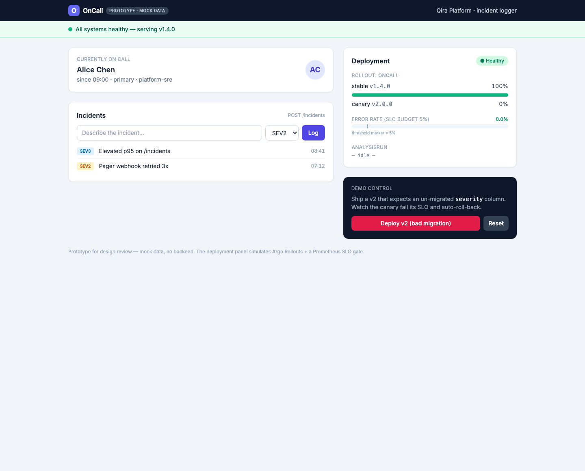
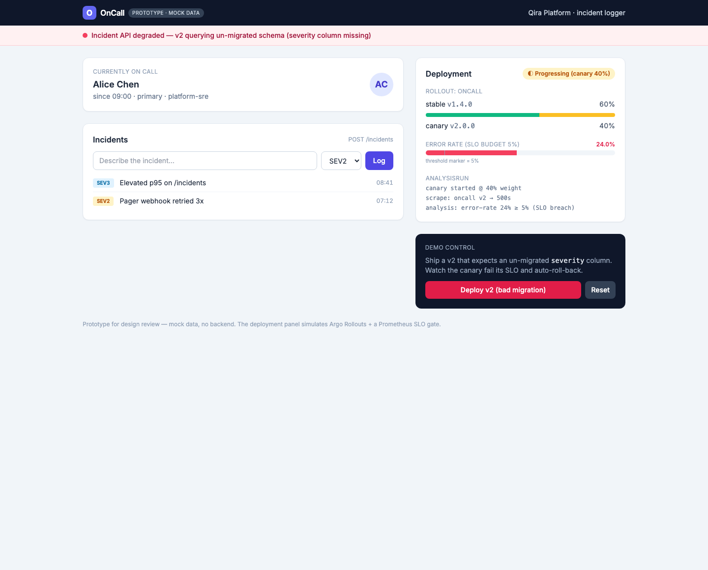
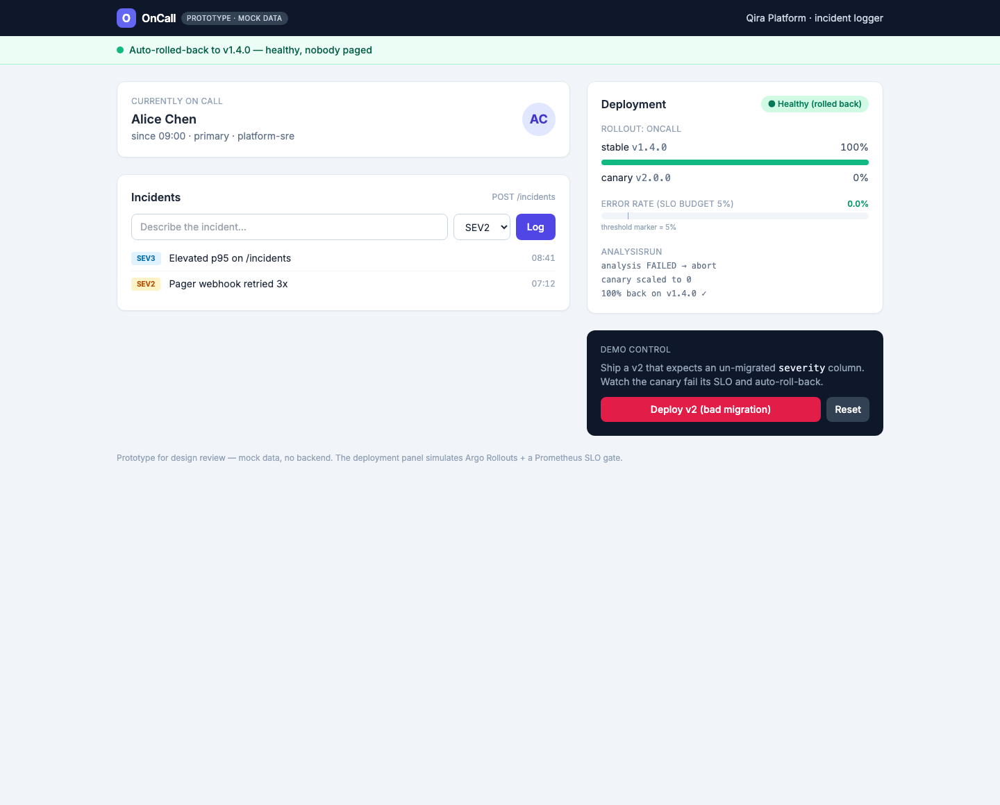

# On-Call Paved Road — interactive mockup

A clickable design prototype of a **deployment-safety demo**: a small on-call / incident logger shipped through a **metric-gated canary** that **auto-rolls-back** a bad release (a v2 that expects an un-migrated `severity` column).

## Live (GitHub Pages)
- **Prototype:** https://onwike.github.io/oncall-mockup/
- **Diagrams:** https://onwike.github.io/oncall-mockup/diagrams/diagrams.html

Click **"Deploy v2 (bad migration)"** to watch the canary breach its 5% error-rate SLO and **auto-roll-back** to the healthy version; **"Reset"** returns to healthy. Deep-link a state with `?state=healthy|canary|rolledback`.

## States

## Note
Design prototype only — **mock data, no backend.** The deployment panel *simulates* Argo Rollouts + a Prometheus SLO gate. The real implementation lives in a separate private repo. Auto-deploys on every push to `main`.
